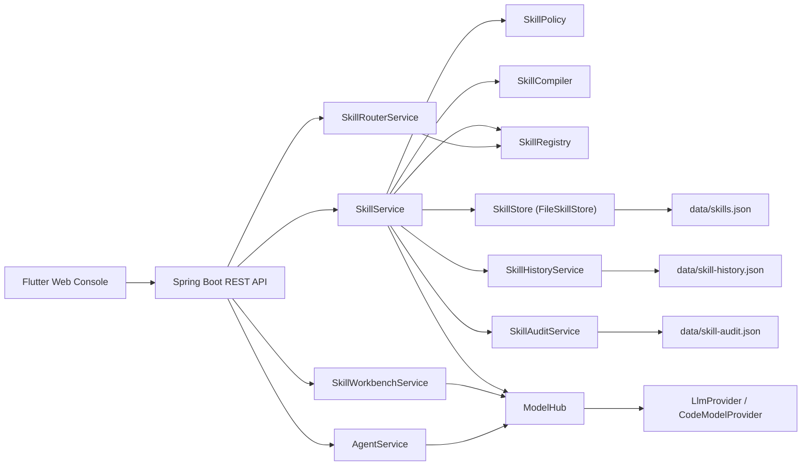

# Architecture

## Overview
EvoForge consists of a Spring Boot + Groovy backend and a Flutter web console. The backend stores skill definitions, compiles them at runtime, and executes them on demand. It also supports generating new skills via a pluggable code model.

## Backend components
- API layer: `SkillController`, `AgentController`, and `ModelController` expose REST endpoints for skills, agent interactions, and model access.
- Skill lifecycle: `SkillStore` persists `SkillDefinition` records, `SkillPolicy` validates code, `SkillCompiler` compiles Groovy classes, `SkillRegistry` holds active compiled skills, and `SkillService` orchestrates create, update, activate, execute, and rollback flows.
- History and audit: `SkillHistoryService` snapshots versions of skills and `SkillAuditService` records lifecycle events and execution outcomes.
- Models and generation: `ModelHub` resolves `LlmProvider` and `CodeModelProvider` implementations, and `SkillWorkbenchService` proposes skill code using the code model with a template fallback.
- Routing and agent flow: `SkillRouterService` selects a skill based on name or metadata keywords, and `AgentService` either executes a skill or calls the LLM when no skill is specified.

## Frontend
The Flutter web console calls the backend REST API to list, edit, activate, and execute skills. It uses `API_BASE_URL` to locate the backend.

## Runtime flows
Create or update a skill:
1. The API receives a request and calls `SkillService`.
2. `SkillPolicy` validates size and banned patterns.
3. `SkillCompiler` compiles the Groovy class.
4. The skill is persisted by `SkillStore` and an audit or history record is written.
5. If enabled, the skill is registered in `SkillRegistry`.

Execute a skill:
1. The API calls `SkillService.execute`.
2. The active skill is loaded from `SkillRegistry`.
3. A new skill instance is created and executed with a `SkillContext`.
4. Audit events capture success or failure, and the result is returned.

Propose or evolve a skill:
1. The API calls `SkillWorkbenchService`.
2. The code model generates candidate code, or a template is used.
3. The proposal is returned to the client or persisted as a new skill.

## Hot reload
`SkillRegistry` refreshes from `SkillStore` on a fixed schedule using `evoforge.skills.autoReloadSeconds`. This enables hot-updating skill code without restarting the backend.

## Component map

