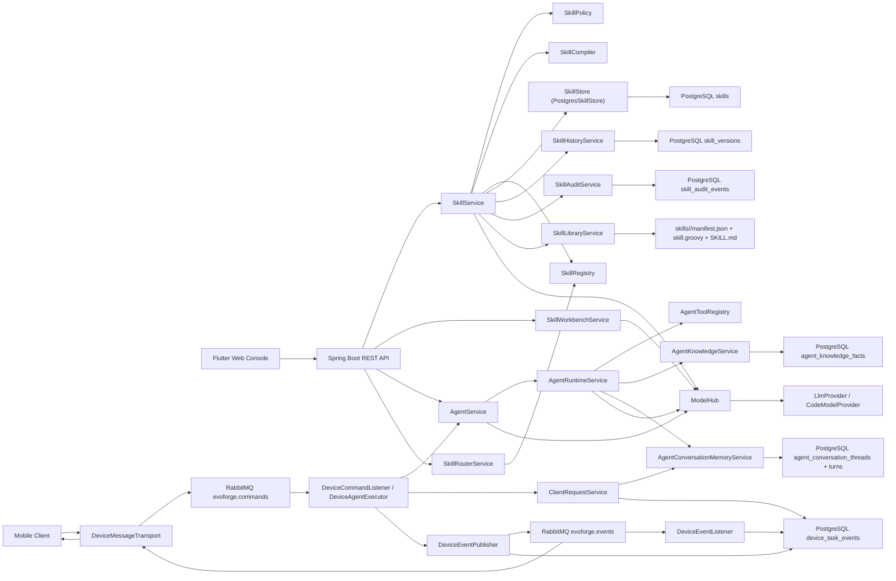

# Architecture

## Overview
EvoForge consists of a Spring Boot + Groovy backend and a Flutter web console. The backend stores skill definitions, compiles them at runtime, and executes them on demand. It also supports generating new skills via a pluggable code model.

## Backend components
- API layer: `SkillController`, `AgentController`, and `ModelController` expose REST endpoints for skills, agent interactions, and model access.
- Skill lifecycle: `SkillStore` persists `SkillDefinition` records in PostgreSQL by default, Flyway manages the schema, `SkillPolicy` validates code, `SkillCompiler` compiles Groovy classes, `SkillRegistry` holds active compiled skills, and `SkillService` orchestrates create, update, activate, execute, and rollback flows.
- History and audit: `SkillHistoryService` snapshots versions of skills and `SkillAuditService` records lifecycle events and execution outcomes.
- Git skill library: `SkillLibraryService` mirrors saved skills to `manifest.json`, `skill.groovy`, and `SKILL.md`, while `SkillLibraryBootstrap` can import those files when the runtime store is empty.
- Remote device agent: when enabled, the PC node consumes mobile commands from RabbitMQ, executes them through `AgentService`, publishes progress/error/result events back to RabbitMQ, and stores task events in PostgreSQL. A service-side event inbox can also consume those returned events and persist them for mobile polling.
- Message bus API: `client_request` commands are generic query/mutation envelopes for clients that cannot reach backend REST. They use a dedicated `.request` routing key and queue, separate from long-running `.command` tasks, so UI data requests are not stuck behind agent execution. The backend handles methods such as `agent.conversations.list`, `agent.conversations.turns`, `device.tasks.list`, and `device.status.get`, then publishes `client_response` events on the event exchange.
- Models and generation: `ModelHub` resolves built-in `LlmProvider` / `CodeModelProvider` beans plus persisted GPT, Claude, and OpenAI-compatible model configs. `SkillWorkbenchService` proposes skill code using the selected code model with a template fallback.
- Dynamic agent runtime: `AgentRuntimeService` handles open-ended natural-language tasks with a planner/observe/replan loop. The LLM proposes multiple candidate routes, chooses one low-risk next tool action, receives the observation, and may switch routes when a path fails. Stable facts are persisted through `AgentKnowledgeService`.
- Thread memory: `AgentConversationMemoryService` stores durable conversation threads plus recent user/assistant turns by `threadId`, so a follow-up in the same frontend conversation carries the earlier constraints into planning. This is the active memory layer; long-term reusable facts still belong in the knowledge store.
- Project learning: `ProjectLearningService` records opted-in Codex tasks as project-scoped knowledge. Each episode includes the submitted task text, `threadId`, selected project, Codex status/output, learning scopes, correction hints, and a pointer to the previous latest change so EvoForge can reconstruct how a project evolved from user-directed work.
- Tools and knowledge: `AgentToolRegistry` exposes stable primitive tools such as `system.info`, `knowledge.search`, `knowledge.upsert`, `path.resolve`, `file.list`, `shell.run`, and `image.analyze`. Tool code is fixed and auditable; task routes are not hard-coded.
- Routing and skill flow: `SkillRouterService` first retrieves a small Top-K set of candidate skills from short metadata (`description`, `keywords`, `tags`, trigger examples, and anti-triggers), then optionally asks the default LLM to choose `USE_SKILL`, `NO_SKILL`, or `NEEDS_NEW_SKILL`. Full skill code is not included in the routing prompt. Explicit skill execution still goes through `SkillService`; open-ended ordinary tasks use the dynamic agent runtime.

## Frontend
The Flutter web console calls the backend REST API to list, edit, activate, and execute skills. The Settings page also manages model provider configs without returning raw API keys to the browser after save. It uses `API_BASE_URL` to locate the backend. Shared mobile-facing helpers build signed RabbitMQ command envelopes, aggregate inbound device events into task timelines, and expose a transport-agnostic controller for mobile UI code. Concrete mobile transports include a generic JSON WebSocket relay and a RabbitMQ Web STOMP client, both behind `DeviceMessageTransport`, so the UI does not depend on a direct AMQP client.

## Runtime flows
Create or update a skill:
1. The API receives a request and calls `SkillService`.
2. `SkillPolicy` validates size and banned patterns.
3. `SkillCompiler` compiles the Groovy class.
4. The skill is persisted by `SkillStore` and an audit or history record is written.
5. The skill is mirrored into the Git skill library.
6. If enabled, the skill is registered in `SkillRegistry`.

Execute a skill:
1. The API calls `SkillService.execute`.
2. The active skill is loaded from `SkillRegistry`.
3. A new skill instance is created and executed with a `SkillContext`.
4. Audit events capture success or failure, and the result is returned.

Route an agent task:
1. The API calls `SkillRouterService.route`.
2. The router scores active skills using metadata only and keeps at most `evoforge.skills.routerCandidateLimit` candidates above `evoforge.skills.routerMinCandidateScore`.
3. If `evoforge.skills.routerUseLlm=true`, the default LLM receives only that candidate metadata and returns one of `USE_SKILL`, `NO_SKILL`, or `NEEDS_NEW_SKILL`.
4. If `/api/agent/route` is called with `execute=true`, a selected skill is executed; a `NO_SKILL` decision falls back to a direct LLM response.

Run an open-ended agent task:
1. `AgentService` sends natural-language tasks without an explicit `skillId` to `AgentRuntimeService` when `evoforge.agent.enabled=true`.
2. The runtime resolves `attributes.threadId` and loads recent same-thread turns from `agent_conversation_turns` or file storage. The current user turn is appended before execution; the assistant answer is appended after completion.
3. The runtime searches reusable knowledge using the current message plus recent thread context, describes available tools, and asks the LLM for JSON containing candidate routes, the selected route, and one next tool action.
4. `AgentToolRegistry` executes only registered tools. `shell.run` is constrained by `evoforge.agent.shellAllowedCommands` and a timeout; tools return structured observations.
5. Observations are fed back into the planner. Failed routes remain visible so the LLM can choose another path instead of stopping at the first error.
6. Reusable facts, such as local OS family or confirmed paths, are stored in `agent_knowledge_facts` or file storage. Transient command output is kept only in the run trace.
7. The final response and the full `agentRun` trace are published in the task event payload for UI inspection.
8. During the run, each planner turn and tool observation is also published as an `agent_progress` event, so message-bus clients can render thinking/action timelines before the final response arrives.

Memory layers:
1. Thread memory is short-term active memory keyed by `threadId`. It keeps the conversation coherent, including corrections and follow-up references.
2. Knowledge facts are durable memory keyed by scope and fact key. They hold reusable discoveries such as OS family, confirmed paths, provider behavior, or stable project facts.
3. The planner prompt treats the latest user message as authoritative when it conflicts with older thread turns, and it only writes long-term knowledge when a fact is reusable beyond the current exchange.
4. The command-center frontend lists persisted threads through `/api/agent/conversations`, restores the most recent thread on entry, and loads visible turn history through `/api/agent/conversations/{threadId}/turns`.

Execute a remote mobile command:
1. The mobile client publishes a command to RabbitMQ directly through Web STOMP or through a JSON WebSocket relay.
2. The PC-side `DeviceCommandListener` consumes the command for this device.
3. When command signing is enabled, `DeviceCommandSignatureService` validates the HMAC, timestamp TTL, and unique `commandId`; PostgreSQL mode persists replay ids in `device_command_replay`.
4. `DeviceAgentExecutor` rejects unsupported command types with `failed`, otherwise publishes `accepted`, then either `needs_approval`, `running`, `completed`, or `failed`.
5. `AgentService` handles natural-language execution or explicit skill execution.
6. `DeviceEventPublisher` signs outbound events when event signing is configured, sends every event back to RabbitMQ, and stores it in `device_task_events`.
7. `DeviceEventListener` can consume the event inbox queue, verify signed returned events, and persist them on the service side.

Approve or reject a remote command:
1. A pending task reaches `needs_approval`.
2. The mobile client can call the REST approval endpoints or publish an `approval_decision` command to the same device command routing key.
3. The PC-side executor applies `approve` or `reject`; approve restores the original command with `approvalGranted=true` and continues execution locally.
4. `approved`, `rejected`, and follow-up execution events are published back to RabbitMQ.

Mobile transport choices:
1. `DeviceRabbitMqWebStompTransport` connects to RabbitMQ Web STOMP, sends command payload JSON to `/exchange/<commandExchange>/<commandRoutingKey>`, and subscribes to events from `/exchange/<eventExchange>/<eventRoutingKey>`.
2. `DeviceJsonRelayTransport` connects to a custom WebSocket relay, sends `{ type, exchange, routingKey, payload }`, and accepts direct or wrapped `DeviceTaskEvent` JSON from that relay.
3. A future native AMQP transport can implement `DeviceMessageTransport` without changing `DeviceMobileSession` or the UI.

Message-bus client request flow:
1. The frontend builds a signed `client_request` command with `attributes.request = { requestId, method, params }`.
2. The command is published to `evoforge.commands` using the configured `user.<userId>.device.<deviceId>.request` routing key. No browser-to-backend HTTP route is required.
3. `DeviceCommandListener` receives it from the request queue and `ClientRequestService` dispatches the method against backend services.
4. The backend publishes a `client_response` event with `payload.clientResponse = { requestId, method, ok, data }` or `{ ok:false, error }`.
5. The frontend subscribes to `evoforge.events`, correlates by `requestId`, and updates UI state from the event stream.

Run a Codex task with project learning:
1. The command center loads configured Codex workspaces from `device.status.get` and sends the selected project as `attributes.projectKey`.
2. When `EvoForge 学习` is enabled, the frontend also sends `attributes.evoforgeLearning` with `sourceProjectKey`, `targetProjectKey=evoforge`, `recordChangeLineage=true`, and learning scopes such as `task-intent`, `change-lineage`, `codex-output`, `errors`, `skills`, and `project-facts`.
3. `CodexTaskExecutor` resolves only configured workspace aliases, then enriches the Codex prompt with relevant project memory from `agent_knowledge_facts` when learning is enabled.
4. After Codex finishes or fails, `DeviceAgentExecutor` calls `ProjectLearningService`. The service writes a timestamped `project.<key>.change.<time>.<task>` episode plus `project.<key>.latest_change` in scope `project:<key>`.
5. The recorded episode includes the user task text, final output/error, same-thread id, selected learning scopes, and `previousChange`, so future runs can see the project change lineage instead of isolated facts.
6. The completion event includes `payload.projectLearning`, allowing the frontend execution log to show exactly what EvoForge recorded.

Propose or evolve a skill:
1. The API calls `SkillWorkbenchService`.
2. The code model generates candidate code, or a template is used.
3. The proposal is returned to the client or persisted as a new skill.

## Hot reload
`SkillRegistry` refreshes from `SkillStore` on a fixed schedule using `evoforge.skills.autoReloadSeconds`. This enables hot-updating skill code without restarting the backend. PostgreSQL is the default runtime store; file-backed JSON storage can still be selected with `EVOFORGE_SKILL_STORAGE_BACKEND=file` or `evoforge.skills.storageBackend=file`.

## Component map

```mermaid
flowchart LR
  UI["Flutter Web Console"] --> API["Spring Boot REST API"]
  Mobile["Mobile Client"] --> MobileTransport["DeviceMessageTransport"]
  MobileTransport --> CmdExchange["RabbitMQ evoforge.commands"]
  EventExchange["RabbitMQ evoforge.events"] --> MobileTransport
  MobileTransport --> Mobile

  API --> SkillSvc["SkillService"]
  API --> Workbench["SkillWorkbenchService"]
  API --> AgentSvc["AgentService"]
  AgentSvc --> AgentRuntime["AgentRuntimeService"]
  AgentRuntime --> Tools["AgentToolRegistry"]
  AgentRuntime --> Knowledge["AgentKnowledgeService"]
  AgentRuntime --> Conversation["AgentConversationMemoryService"]
  API --> Router["SkillRouterService"]
  CmdExchange --> DeviceAgent["DeviceCommandListener / DeviceAgentExecutor"]
  DeviceAgent --> AgentSvc
  DeviceAgent --> ClientRequests["ClientRequestService"]
  DeviceAgent --> EventPublisher["DeviceEventPublisher"]
  EventPublisher --> EventExchange
  EventExchange --> EventInbox["DeviceEventListener"]
  EventInbox --> PgTaskEvents

  SkillSvc --> Policy["SkillPolicy"]
  SkillSvc --> Compiler["SkillCompiler"]
  SkillSvc --> Registry["SkillRegistry"]
  SkillSvc --> Store["SkillStore (PostgresSkillStore)"]
  SkillSvc --> History["SkillHistoryService"]
  SkillSvc --> Audit["SkillAuditService"]
  SkillSvc --> Library["SkillLibraryService"]
  SkillSvc --> ModelHub["ModelHub"]

  Workbench --> ModelHub
  AgentSvc --> ModelHub
  AgentRuntime --> ModelHub
  ClientRequests --> Conversation
  ClientRequests --> PgTaskEvents
  Router --> Registry

  Store --> PgSkills["PostgreSQL skills"]
  History --> PgHistory["PostgreSQL skill_versions"]
  Audit --> PgAudit["PostgreSQL skill_audit_events"]
  EventPublisher --> PgTaskEvents["PostgreSQL device_task_events"]
  Knowledge --> PgKnowledge["PostgreSQL agent_knowledge_facts"]
  Conversation --> PgConversation["PostgreSQL agent_conversation_threads + turns"]
  Library --> GitFiles["skills/<id>/manifest.json + skill.groovy + SKILL.md"]

  ModelHub --> Providers["LlmProvider / CodeModelProvider"]
```
