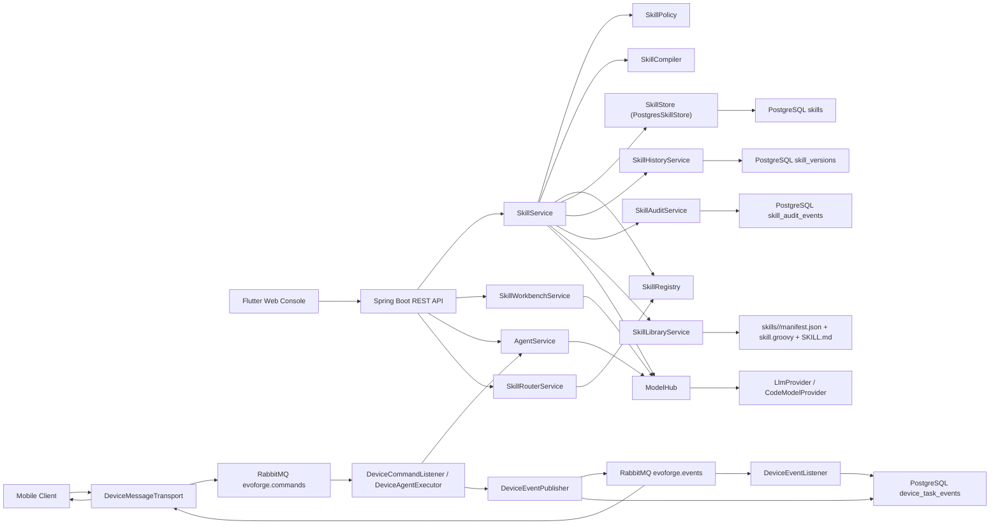

# Architecture

## Overview
EvoForge consists of a Spring Boot + Groovy backend and a Flutter web console. The backend stores skill definitions, compiles them at runtime, and executes them on demand. It also supports generating new skills via a pluggable code model.

## Backend components
- API layer: `SkillController`, `AgentController`, and `ModelController` expose REST endpoints for skills, agent interactions, and model access.
- Skill lifecycle: `SkillStore` persists `SkillDefinition` records in PostgreSQL by default, Flyway manages the schema, `SkillPolicy` validates code, `SkillCompiler` compiles Groovy classes, `SkillRegistry` holds active compiled skills, and `SkillService` orchestrates create, update, activate, execute, and rollback flows.
- History and audit: `SkillHistoryService` snapshots versions of skills and `SkillAuditService` records lifecycle events and execution outcomes.
- Git skill library: `SkillLibraryService` mirrors saved skills to `manifest.json`, `skill.groovy`, and `SKILL.md`, while `SkillLibraryBootstrap` can import those files when the runtime store is empty.
- Remote device agent: when enabled, the PC node consumes mobile commands from RabbitMQ, executes them through `AgentService`, publishes progress/error/result events back to RabbitMQ, and stores task events in PostgreSQL. A service-side event inbox can also consume those returned events and persist them for mobile polling.
- Models and generation: `ModelHub` resolves built-in `LlmProvider` / `CodeModelProvider` beans plus persisted GPT, Claude, and OpenAI-compatible model configs. `SkillWorkbenchService` proposes skill code using the selected code model with a template fallback.
- Routing and agent flow: `SkillRouterService` first retrieves a small Top-K set of candidate skills from short metadata (`description`, `keywords`, `tags`, trigger examples, and anti-triggers), then optionally asks the default LLM to choose `USE_SKILL`, `NO_SKILL`, or `NEEDS_NEW_SKILL`. Full skill code is not included in the routing prompt. `AgentService` either executes the selected skill or calls the LLM directly when no skill is needed.

## Frontend
The Flutter web console calls the backend REST API to list, edit, activate, and execute skills. The Settings page also manages model provider configs without returning raw API keys to the browser after save. It uses `API_BASE_URL` to locate the backend. Shared mobile-facing helpers build signed RabbitMQ command envelopes, aggregate inbound device events into task timelines, and expose a transport-agnostic controller for mobile UI code. Concrete mobile transports include a generic JSON WebSocket relay and a RabbitMQ Web STOMP client, both behind `DeviceMessageTransport`, so the UI does not depend on a direct AMQP client.

## Runtime flows
Create or update a skill:
1. The API receives a request and calls `SkillService`.
2. `SkillPolicy` validates size and banned patterns.
3. `SkillCompiler` compiles the Groovy class.
4. The skill is persisted by `SkillStore` and an audit or history record is written.
5. The skill is mirrored into the Git skill library.
6. If enabled, the skill is registered in `SkillRegistry`.

Execute a skill:
1. The API calls `SkillService.execute`.
2. The active skill is loaded from `SkillRegistry`.
3. A new skill instance is created and executed with a `SkillContext`.
4. Audit events capture success or failure, and the result is returned.

Route an agent task:
1. The API calls `SkillRouterService.route`.
2. The router scores active skills using metadata only and keeps at most `evoforge.skills.routerCandidateLimit` candidates above `evoforge.skills.routerMinCandidateScore`.
3. If `evoforge.skills.routerUseLlm=true`, the default LLM receives only that candidate metadata and returns one of `USE_SKILL`, `NO_SKILL`, or `NEEDS_NEW_SKILL`.
4. If `/api/agent/route` is called with `execute=true`, a selected skill is executed; a `NO_SKILL` decision falls back to a direct LLM response.

Execute a remote mobile command:
1. The mobile client publishes a command to RabbitMQ directly through Web STOMP or through a JSON WebSocket relay.
2. The PC-side `DeviceCommandListener` consumes the command for this device.
3. When command signing is enabled, `DeviceCommandSignatureService` validates the HMAC, timestamp TTL, and unique `commandId`; PostgreSQL mode persists replay ids in `device_command_replay`.
4. `DeviceAgentExecutor` rejects unsupported command types with `failed`, otherwise publishes `accepted`, then either `needs_approval`, `running`, `completed`, or `failed`.
5. `AgentService` handles natural-language execution or explicit skill execution.
6. `DeviceEventPublisher` signs outbound events when event signing is configured, sends every event back to RabbitMQ, and stores it in `device_task_events`.
7. `DeviceEventListener` can consume the event inbox queue, verify signed returned events, and persist them on the service side.

Approve or reject a remote command:
1. A pending task reaches `needs_approval`.
2. The mobile client can call the REST approval endpoints or publish an `approval_decision` command to the same device command routing key.
3. The PC-side executor applies `approve` or `reject`; approve restores the original command with `approvalGranted=true` and continues execution locally.
4. `approved`, `rejected`, and follow-up execution events are published back to RabbitMQ.

Mobile transport choices:
1. `DeviceRabbitMqWebStompTransport` connects to RabbitMQ Web STOMP, sends command payload JSON to `/exchange/<commandExchange>/<commandRoutingKey>`, and subscribes to events from `/exchange/<eventExchange>/<eventRoutingKey>`.
2. `DeviceJsonRelayTransport` connects to a custom WebSocket relay, sends `{ type, exchange, routingKey, payload }`, and accepts direct or wrapped `DeviceTaskEvent` JSON from that relay.
3. A future native AMQP transport can implement `DeviceMessageTransport` without changing `DeviceMobileSession` or the UI.

Propose or evolve a skill:
1. The API calls `SkillWorkbenchService`.
2. The code model generates candidate code, or a template is used.
3. The proposal is returned to the client or persisted as a new skill.

## Hot reload
`SkillRegistry` refreshes from `SkillStore` on a fixed schedule using `evoforge.skills.autoReloadSeconds`. This enables hot-updating skill code without restarting the backend. PostgreSQL is the default runtime store; file-backed JSON storage can still be selected with `EVOFORGE_SKILL_STORAGE_BACKEND=file` or `evoforge.skills.storageBackend=file`.

## Component map

```mermaid
flowchart LR
  UI["Flutter Web Console"] --> API["Spring Boot REST API"]
  Mobile["Mobile Client"] --> MobileTransport["DeviceMessageTransport"]
  MobileTransport --> CmdExchange["RabbitMQ evoforge.commands"]
  EventExchange["RabbitMQ evoforge.events"] --> MobileTransport
  MobileTransport --> Mobile

  API --> SkillSvc["SkillService"]
  API --> Workbench["SkillWorkbenchService"]
  API --> AgentSvc["AgentService"]
  API --> Router["SkillRouterService"]
  CmdExchange --> DeviceAgent["DeviceCommandListener / DeviceAgentExecutor"]
  DeviceAgent --> AgentSvc
  DeviceAgent --> EventPublisher["DeviceEventPublisher"]
  EventPublisher --> EventExchange
  EventExchange --> EventInbox["DeviceEventListener"]
  EventInbox --> PgTaskEvents

  SkillSvc --> Policy["SkillPolicy"]
  SkillSvc --> Compiler["SkillCompiler"]
  SkillSvc --> Registry["SkillRegistry"]
  SkillSvc --> Store["SkillStore (PostgresSkillStore)"]
  SkillSvc --> History["SkillHistoryService"]
  SkillSvc --> Audit["SkillAuditService"]
  SkillSvc --> Library["SkillLibraryService"]
  SkillSvc --> ModelHub["ModelHub"]

  Workbench --> ModelHub
  AgentSvc --> ModelHub
  Router --> Registry

  Store --> PgSkills["PostgreSQL skills"]
  History --> PgHistory["PostgreSQL skill_versions"]
  Audit --> PgAudit["PostgreSQL skill_audit_events"]
  EventPublisher --> PgTaskEvents["PostgreSQL device_task_events"]
  Library --> GitFiles["skills/<id>/manifest.json + skill.groovy + SKILL.md"]

  ModelHub --> Providers["LlmProvider / CodeModelProvider"]
```
